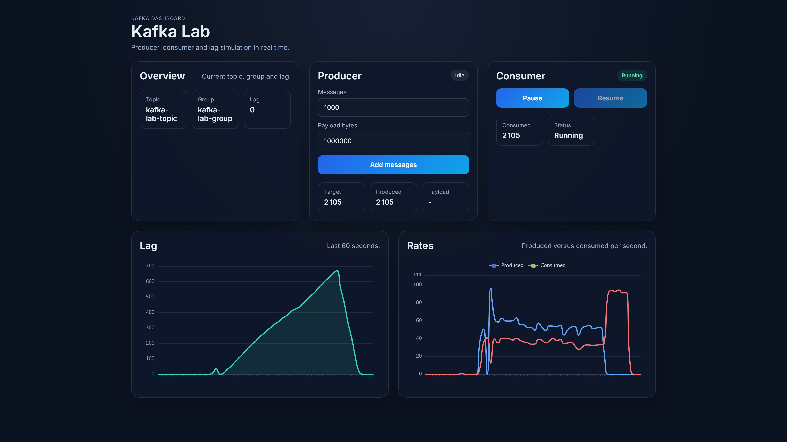

# Kafka Lab


> A real-time Kafka monitoring dashboard to simulate and visualize producer/consumer lag.



## Overview

Kafka Lab is an open-source dashboard to simulate and observe Kafka lag in real time.
It lets you produce messages, pause/resume the consumer, and watch the lag evolve live.

Built as a portfolio project to demonstrate distributed systems knowledge with Kafka, Spring Boot and React.

## Features

- ⚡ **Real-time lag** — live lag chart updated every 500ms
- 📦 **Producer control** — configure message count and payload size
- ⏸️ **Consumer control** — pause and resume the consumer group
- 📈 **Rates chart** — produced vs consumed messages per second
- 🐳 **One command** — full stack with `docker compose up`

## Tech Stack

| Layer        | Tech                          |
|--------------|-------------------------------|
| Backend      | Java 21, Spring Boot 3, Kafka |
| Frontend     | React 19, Vite, Tailwind CSS  |
| Charts       | Apache ECharts                |
| Broker       | Apache Kafka (KRaft mode)     |
| Infra        | Docker Compose                |

## Getting Started

### Prerequisites

- Docker + Docker Compose
- Java 21 + Maven (for local dev only)

### Run with Docker

```bash
git clone https://github.com/jr2dallas/kafka-lab.git
cd kafka-lab
docker compose up --build
```

Open [http://localhost](http://localhost)

### Local dev

```bash
# Start Kafka only
docker compose up kafka

# Backend
cd backend && mvn spring-boot:run

# Frontend
cd frontend && npm install && npm run dev
```

Open [http://localhost:5173](http://localhost:5173)

## Architecture

kafka-lab/\
├── backend/ `# Spring Boot — REST API + Kafka producer/consumer`\
├── frontend/ `# React + Vite — real-time dashboard`\
└── docker-compose.yml

### How it works

[React Dashboard]\
│ POST /api/producer/generations\
│ POST /api/consumer/pause|resume\
│ GET /api/dashboard/status

[Spring Boot Backend]\
│ produce messages\
│ consume messages

[Apache Kafka (KRaft)]\
kafka-lab-topic (1 partition)\
kafka-lab-group (1 consumer)

## API

| Method | Endpoint                    | Description              |
|--------|-----------------------------|--------------------------|
| GET    | `/api/dashboard/status`     | Full dashboard snapshot  |
| POST   | `/api/producer/generations` | Start a production job   |
| POST   | `/api/consumer/pause`       | Pause the consumer       |
| POST   | `/api/consumer/resume`      | Resume the consumer      |

## License

Apache License 2.0